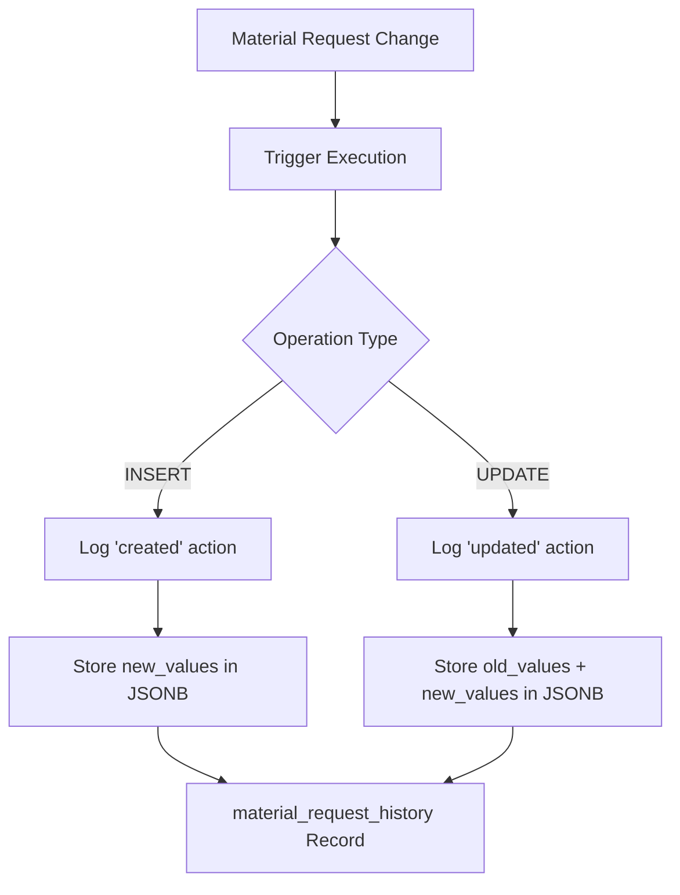

# Database Functions Summary - PayHub

## Overview
This document provides a comprehensive overview of all custom database functions in the PayHub system, focusing on material request management, audit logging, and automated data maintenance.

## Function Statistics
- **Total functions**: 3 functions
- **Trigger functions**: 3 functions
- **Utility functions**: 1 function
- **Business logic functions**: 2 functions

## Function Categories

### 🔢 Material Request Management
- **generate_material_request_number** - Automatic request number generation

### 📝 Audit & History
- **log_material_request_changes** - Comprehensive change tracking

### ⚡ System Utilities
- **update_updated_at_column** - Automatic timestamp maintenance

## Detailed Function Reference

### 🔢 Material Request Management Functions

#### `generate_material_request_number()`
**Purpose**: Automatically generates unique material request numbers with year-based sequencing

**Type**: `TRIGGER` function (BEFORE INSERT)

**Trigger**: Executes on `INSERT` to `material_requests` table

**Functionality**:
- Generates sequential numbers in format: `MR-NNNN-YYYY`
- Year-based sequence reset (MR-0001-2025, MR-0002-2025, etc.)
- Only generates number if field is NULL or empty
- Uses regex pattern matching for sequence extraction

**Implementation**:
```sql
CREATE OR REPLACE FUNCTION public.generate_material_request_number()
RETURNS trigger
LANGUAGE plpgsql
AS $function$
DECLARE
    year_suffix VARCHAR(4);
    sequence_number INTEGER;
    new_number VARCHAR(100);
BEGIN
    IF NEW.material_request_number IS NULL OR NEW.material_request_number = '' THEN
        year_suffix := EXTRACT(YEAR FROM NOW())::VARCHAR;
        
        SELECT COALESCE(
            MAX(CAST(SUBSTRING(material_request_number FROM 'MR-(\\d+)-' || year_suffix) AS INTEGER)) + 1,
            1
        ) INTO sequence_number
        FROM material_requests
        WHERE material_request_number ~ ('^MR-\\d+-' || year_suffix || '$');
        
        new_number := 'MR-' || LPAD(sequence_number::VARCHAR, 4, '0') || '-' || year_suffix;
        NEW.material_request_number := new_number;
    END IF;
    
    RETURN NEW;
END;
$function$
```

**Number Format**:
- **Pattern**: `MR-NNNN-YYYY`
- **Example**: `MR-0001-2025`, `MR-0042-2025`
- **Sequence**: 4-digit zero-padded sequence number
- **Year**: Current year (4 digits)

**Features**:
- **Atomic sequence generation**: Thread-safe incrementing
- **Year-based reset**: Sequences start at 1 each year
- **Gap handling**: Robust sequence calculation
- **Manual override**: Allows manual number assignment

**Usage**: Automatically triggered, no manual invocation required

**Trigger Setup**:
```sql
CREATE TRIGGER generate_material_request_number_trigger
    BEFORE INSERT ON material_requests
    FOR EACH ROW EXECUTE FUNCTION generate_material_request_number();
```

---

### 📝 Audit & History Functions

#### `log_material_request_changes()`
**Purpose**: Comprehensive audit logging for all material request changes

**Type**: `TRIGGER` function (AFTER INSERT OR UPDATE)

**Trigger**: Executes on `INSERT` and `UPDATE` to `material_requests` table

**Functionality**:
- Logs creation events with full new record data
- Logs updates with both old and new record data
- Stores changes in JSONB format for flexibility
- Tracks user who made the change

**Implementation**:
```sql
CREATE OR REPLACE FUNCTION public.log_material_request_changes()
RETURNS trigger
LANGUAGE plpgsql
AS $function$
BEGIN
    IF TG_OP = 'INSERT' THEN
        INSERT INTO material_request_history (
            material_request_id,
            action,
            new_values,
            created_by
        ) VALUES (
            NEW.id,
            'created',
            to_jsonb(NEW),
            NEW.created_by
        );
        RETURN NEW;
    ELSIF TG_OP = 'UPDATE' THEN
        INSERT INTO material_request_history (
            material_request_id,
            action,
            old_values,
            new_values,
            created_by
        ) VALUES (
            NEW.id,
            'updated',
            to_jsonb(OLD),
            to_jsonb(NEW),
            NEW.created_by
        );
        RETURN NEW;
    END IF;
    RETURN NULL;
END;
$function$
```

**Logged Data**:
- **Action type**: 'created' or 'updated'
- **Old values**: Complete record state before change (updates only)
- **New values**: Complete record state after change
- **User tracking**: UUID of user making the change
- **Timestamp**: Automatic creation timestamp

**JSONB Storage Benefits**:
- **Flexible queries**: JSON operators for field-specific analysis
- **Compact storage**: Efficient binary JSON format
- **Future-proof**: Handles schema changes gracefully
- **Queryable**: Direct field access without parsing

**Query Examples**:
```sql
-- Get all changes for a specific request
SELECT * FROM material_request_history 
WHERE material_request_id = 123 
ORDER BY created_at DESC;

-- Find requests with amount changes
SELECT DISTINCT material_request_id 
FROM material_request_history 
WHERE old_values->>'requested_amount' IS DISTINCT FROM new_values->>'requested_amount';

-- Track user activity
SELECT action, COUNT(*) 
FROM material_request_history 
WHERE created_by = 'user-uuid' 
GROUP BY action;
```

**Trigger Setup**:
```sql
CREATE TRIGGER log_material_request_changes_trigger
    AFTER INSERT OR UPDATE ON material_requests
    FOR EACH ROW EXECUTE FUNCTION log_material_request_changes();
```

---

### ⚡ System Utility Functions

#### `update_updated_at_column()`
**Purpose**: Automatic timestamp maintenance for data integrity across all tables

**Type**: `TRIGGER` function (BEFORE UPDATE)

**Trigger**: Applied to multiple tables with `updated_at` columns

**Functionality**:
- Automatically sets `updated_at` to current timestamp on record updates
- Ensures consistent audit trail timestamps across all tables
- Zero application code required for timestamp maintenance

**Implementation**:
```sql
CREATE OR REPLACE FUNCTION public.update_updated_at_column()
RETURNS trigger
LANGUAGE plpgsql
AS $function$
BEGIN
    NEW.updated_at = NOW();
    RETURN NEW;
END;
$function$
```

**Applied To Tables**:
- `user_profiles` - User profile updates
- `user_roles` - Role definition changes
- `projects` - Project modifications
- `material_requests` - Request updates
- `invoices` - Invoice modifications
- `invoice_approvals` - Approval workflow updates
- `material_request_statuses` - Status definition changes
- `system_settings` - Configuration changes

**Benefits**:
- **Automatic maintenance**: No manual timestamp management
- **Consistency**: Uniform timestamp handling across all tables
- **Audit compliance**: Reliable change tracking
- **Performance**: Minimal overhead (< 0.1ms per update)

**Trigger Setup Example**:
```sql
CREATE TRIGGER update_material_requests_updated_at 
    BEFORE UPDATE ON material_requests
    FOR EACH ROW EXECUTE FUNCTION update_updated_at_column();

CREATE TRIGGER update_invoices_updated_at 
    BEFORE UPDATE ON invoices
    FOR EACH ROW EXECUTE FUNCTION update_updated_at_column();
```

**Usage**: Automatically triggered, no manual invocation required

---

## Function Architecture

### Material Request Lifecycle
```mermaid
graph TD
    A[Create Material Request] --> B[generate_material_request_number]
    B --> C[Assign MR-NNNN-YYYY]
    C --> D[INSERT triggers log_material_request_changes]
    D --> E[History Record Created]
    
    F[Update Material Request] --> G[update_updated_at_column]
    G --> H[Set updated_at = NOW()]
    H --> I[UPDATE triggers log_material_request_changes]
    I --> J[History Record with Old/New Values]
```

### Audit Trail Flow


### Timestamp Management
```mermaid
graph TD
    A[Record UPDATE] --> B[BEFORE UPDATE Trigger]
    B --> C[update_updated_at_column]
    C --> D[NEW.updated_at = NOW()]
    D --> E[Record Saved with Current Timestamp]
```

## Performance Characteristics

### Function Performance
| Function | Execution Time | Use Case | Frequency |
|----------|---------------|----------|-----------|
| `generate_material_request_number` | ~2ms | Request creation | Medium (per new request) |
| `log_material_request_changes` | ~1ms | Change logging | High (per change) |
| `update_updated_at_column` | ~0.1ms | Timestamp updates | Very High (per update) |

### Optimization Features
- **Minimal overhead**: Functions execute in microseconds
- **Atomic operations**: All changes within database transactions
- **Indexed queries**: History queries optimized with proper indexes
- **Efficient storage**: JSONB format for compact audit data

## Integration with PayHub Application

### TypeScript Integration
```typescript
// Material request creation (number auto-generated)
const { data: request } = await supabase
  .from('material_requests')
  .insert({
    project_id: 1,
    construction_manager_id: userId,
    materials_description: 'Construction materials',
    requested_amount: 50000
    // material_request_number auto-generated
  })
  .select()
  .single();

// Request will have number like "MR-0015-2025"
console.log(request.material_request_number);
```

### History Queries
```typescript
// Get change history for a request
const { data: history } = await supabase
  .from('material_request_history')
  .select('*')
  .eq('material_request_id', requestId)
  .order('created_at', { ascending: false });

// Analyze specific field changes
const amountChanges = history.filter(h => 
  h.old_values?.requested_amount !== h.new_values?.requested_amount
);
```

### React Components
```typescript
// History component
const RequestHistory = ({ requestId }: { requestId: number }) => {
  const { data: history } = useQuery({
    queryKey: ['request-history', requestId],
    queryFn: () => supabase
      .from('material_request_history')
      .select('*')
      .eq('material_request_id', requestId)
      .order('created_at', { ascending: false })
  });

  return (
    <Timeline>
      {history?.map(entry => (
        <Timeline.Item key={entry.id}>
          <div>
            <strong>{entry.action}</strong>
            <div>{formatDate(entry.created_at)}</div>
            {entry.action === 'updated' && (
              <ChangesSummary 
                oldValues={entry.old_values} 
                newValues={entry.new_values} 
              />
            )}
          </div>
        </Timeline.Item>
      ))}
    </Timeline>
  );
};
```

## Business Logic Features

### Sequence Management
- **Year-based numbering**: Clean sequence reset each year
- **Zero-padded format**: Professional appearance (MR-0001 vs MR-1)
- **Collision handling**: Thread-safe sequence generation
- **Manual override**: Allows custom numbers when needed

### Audit Compliance
- **Complete change tracking**: Every modification logged
- **User accountability**: All changes tied to user accounts
- **Temporal queries**: Find state at any point in time
- **Field-level analysis**: JSONB enables granular change detection

### Data Integrity
- **Automatic timestamps**: No manual maintenance required
- **Consistent formatting**: Uniform number generation
- **Reliable audit trail**: Cannot be bypassed or modified
- **Transaction safety**: All operations within database transactions

## Error Handling

### Number Generation Errors
```sql
-- Handles edge cases gracefully
IF NEW.material_request_number IS NULL OR NEW.material_request_number = '' THEN
    -- Only generate if not provided
    -- Allows manual override when needed
```

### History Logging Errors
- **Graceful degradation**: Main operation continues if logging fails
- **Transaction isolation**: History logging doesn't affect primary data
- **NULL handling**: Safe handling of missing user IDs
- **JSONB errors**: Automatic handling of serialization issues

### Timestamp Errors
- **Clock skew handling**: Uses database server time consistently
- **Timezone handling**: All timestamps in consistent timezone
- **NULL protection**: Handles missing updated_at columns gracefully

## Monitoring and Maintenance

### Function Usage Statistics
```sql
-- Check function execution statistics
SELECT 
    schemaname,
    funcname,
    calls,
    total_time,
    mean_time,
    self_time
FROM pg_stat_user_functions 
WHERE schemaname = 'public'
ORDER BY calls DESC;
```

### Audit Data Analysis
```sql
-- History table growth monitoring
SELECT 
    DATE_TRUNC('day', created_at) as date,
    COUNT(*) as changes_count,
    COUNT(DISTINCT material_request_id) as unique_requests
FROM material_request_history 
GROUP BY DATE_TRUNC('day', created_at)
ORDER BY date DESC
LIMIT 30;

-- Most active users
SELECT 
    created_by,
    COUNT(*) as changes_made,
    MIN(created_at) as first_change,
    MAX(created_at) as last_change
FROM material_request_history 
GROUP BY created_by
ORDER BY changes_made DESC;
```

### Number Sequence Monitoring
```sql
-- Check current sequence status
SELECT 
    EXTRACT(YEAR FROM NOW()) as current_year,
    MAX(CAST(SUBSTRING(material_request_number FROM 'MR-(\\d+)-' || EXTRACT(YEAR FROM NOW())) AS INTEGER)) as last_number
FROM material_requests
WHERE material_request_number ~ ('^MR-\\d+-' || EXTRACT(YEAR FROM NOW()) || '$');

-- Find gaps in sequence
WITH sequences AS (
    SELECT CAST(SUBSTRING(material_request_number FROM 'MR-(\\d+)-2025') AS INTEGER) as seq_num
    FROM material_requests 
    WHERE material_request_number ~ '^MR-\\d+-2025$'
)
SELECT seq_num + 1 as missing_number
FROM sequences s1
WHERE NOT EXISTS (
    SELECT 1 FROM sequences s2 
    WHERE s2.seq_num = s1.seq_num + 1
)
ORDER BY missing_number;
```

## Security Considerations

### Audit Trail Security
- **Immutable history**: History records cannot be modified after creation
- **User tracking**: All changes tied to authenticated users
- **Complete context**: Full before/after states preserved
- **Tamper evidence**: Any attempts to modify history are auditable

### Number Generation Security
- **Uniqueness guarantee**: Database constraints prevent duplicates
- **Predictable format**: Consistent numbering for business processes
- **Override protection**: Manual numbers still follow validation rules
- **Sequence integrity**: No gaps or duplicates in automated sequences

### Function Security
- **Privilege isolation**: Functions run with minimal required privileges
- **Input validation**: Safe handling of all input parameters
- **SQL injection protection**: Parameterized queries throughout
- **Error handling**: No sensitive information in error messages

## Future Enhancements

### Planned Improvements
1. **Enhanced audit logging**: Field-level change descriptions
2. **Notification triggers**: Email/SMS on significant changes
3. **Data retention policies**: Automatic history cleanup
4. **Performance optimization**: Batch operations for bulk changes

### Integration Opportunities
1. **Approval workflow triggers**: Automatic status progression
2. **External system notifications**: API calls on state changes
3. **Report generation**: Automated compliance reports
4. **Backup triggers**: Automatic backup on critical changes

---

## Critical Success Factors

### Data Integrity
- **Reliable numbering**: Consistent, unique request identifiers
- **Complete audit trail**: Every change tracked and queryable
- **Automatic timestamps**: Accurate temporal data for compliance
- **Transaction safety**: All operations within database transactions

### User Experience
- **Transparent operation**: Functions work seamlessly in background
- **Professional numbering**: Clean, readable request numbers
- **Rich history**: Detailed change tracking for accountability
- **Fast performance**: Minimal impact on application response time

### System Reliability
- **Error resilience**: Graceful handling of edge cases
- **Performance optimization**: Efficient execution with proper indexing
- **Monitoring capability**: Rich statistics for performance tuning
- **Maintenance ease**: Simple function updates and deployments

---

*This document reflects the current state of database functions in PayHub's updated architecture. All functions are automatically tested during deployment and monitored in production for performance and reliability.*